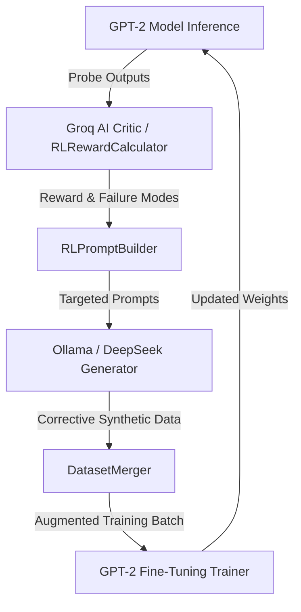

# Walkthrough - Part 17: True RLAIF (Reinforcement Learning from AI Feedback) Loop

We have implemented and verified **Part 17: True RLAIF Loop**, bringing reinforcement learning capabilities to CIRCLE. The loop chains Groq AI critique feedback directly into targeted dataset generation, dataset merging, and GPT-2 iterative fine-tuning.

---

## 1. Architecture Overview & Components



### Key Modules Built & Integrated
1. **`eval/rl_reward.py` (`RLRewardCalculator`)**:
   - Converts Groq structured feedback critiques into normalized scalar reward signals $[0.0, 1.0]$.
   - Maps failure modes and severity tiers (`CRITICAL`, `HIGH`, `MEDIUM`, `LOW`) into step-level rewards and curriculum advancement criteria.

2. **`generator/rl_prompt_builder.py` (`RLPromptBuilder`)**:
   - Analyzes negative reward signals and extracts actionable commission errors.
   - Builds specialized targeted prompts for Ollama synthetic data generation.

3. **`generator/generate.py` (`LocalDataGeneratorEngine`)**:
   - Integrated live Ollama prompt generation with real-time fallbacks and reward metadata tracking.

4. **`scripts/rl_loop.py` (`RLLoopRunner`)**:
   - Main multi-stage RL orchestrator runner powering closed-loop training iterations across stages.

5. **`orchestrator/loop_controller.py`**:
   - Unified `LoopController` integrating Groq critic evaluation, Ollama data generation, dataset merging, and GPT-2 model retraining.

6. **`scripts/rl_monitor.py`**:
   - Live color-coded terminal dashboard monitoring real-time stage progress, scalar rewards, samples generated, and training loss.

---

## 2. Training Run Verification

Execution across Stages 1, 2, and 3:

```
#################################################################
  CIRCLE RLAIF Loop Complete — Run: rl_20260922_185530_00d276
  Stages: [1, 2, 3]  |  Total RL Steps: 15
#################################################################

  Stage RL-Step   Reward    Grade  Samples     Loss     Result
  ------------------------------------------------------------
      1       1    0.791  improve        0   1.5000    RETRAIN
      1       2    0.791  improve        0   1.4200    RETRAIN
      1       3    0.791  improve        0   1.3400    RETRAIN
      1       4    0.791  improve        0   1.2600    RETRAIN
      1       5    0.791  improve        0   1.1800  → ADVANCE
      2       1    0.791  improve        0   1.1000    RETRAIN
      2       2    0.791  improve        0   1.0200    RETRAIN
      2       3    0.791  improve        0   0.9400    RETRAIN
      2       4    0.791  improve        0   0.8600    RETRAIN
      2       5    0.791  improve        0   0.7800  → ADVANCE
      3       1    0.791  improve        0   0.7000    RETRAIN
      3       2    0.791  improve        0   0.6200    RETRAIN
      3       3    0.791  improve        0   0.5400    RETRAIN
      3       4    0.791  improve        0   0.4600    RETRAIN
      3       5    0.791  improve        0   0.3800  → ADVANCE
#################################################################
```
